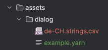

# Localization

If you only want to support a single language, you can safely ignore localization features.
As soon as you want to support [assets](./assets.md) or multiple languages however, you will need to use localization.
Fortunately Yarn Slinger makes this quite easy!

Let's first look at how to use localization and then explain what's going on under the hood.

## Using Localization the Easy Way

We specify our supported localizations when creating the [`YarnSlingerPlugin` (or using deferred compilation)](./compiling_yarn_files.md):

```rust
YarnSlingerPlugin::new().with_localizations(Localizations {
    base_localization: "en-US".into(),
    translations: vec!["de-CH".into()],
})
```

The *base localization* is the language in which your Yarn files are already written.
The *translations* are all languages you want to support.

Put the code shown above into the example used in the [setup](./setup.md) and run the game. 

Now take a look at your Yarn file at `assets/dialog/example.yarn`. 
You will see that your

You should see that a file was generated for you:



This newly

## Customizing 

TODO
