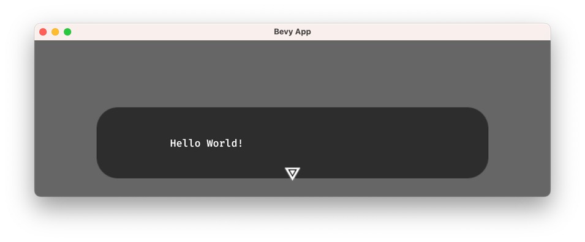

# Setup

We will now go through the steps to setup a new Bevy project running Yarn Slinger dialogs. 
This is the same setup as in the chapter [Running Examples](../yarn_files/running_examples.md), but with explanations this time.
If you've followed along in the linked chapter already, you can just read this part without executing anything.

## Setting up the crate

Run the following in your terminal to create a new crate with the required dependencies:

```bash
cargo new yarn_slinger_playground
cd yarn_slinger_playground
cargo add bevy --features filesystem_watcher
cargo add bevy_yarn_slinger bevy_yarn_slinger_example_dialogue_view
```

The line `cargo add bevy --features filesystem_watcher` ensures that we can use *hot reloading* in our project, which means that we can edit the Yarn files
while the game is running and it will reload them automatically on change.

The dependency `bevy_yarn_slinger` is for the Yarn Slinger Bevy plugin proper, while `bevy_yarn_slinger_example_dialogue_view` 
gives us a nice default [dialog view](./dialog_views.md), so we can actually see the text we've written and have options to click on.

## Adding the Yarn Files

We'll use a single Yarn file for this example. Inside the folder `assets/dialog`, add a file named `example.yarn` with the following content:
```text
# assets/dialogue/example.yarn
title: Start
---
Hello World!
===
```

## The main code

Add the following code to your `src/main.rs`.

```rust
// src/main.rs
use bevy::prelude::*;
use bevy_yarn_slinger::prelude::*;
use bevy_yarn_slinger_example_dialogue_view::prelude::*;

fn main() {
    let mut app = App::new();
    app.add_plugins(DefaultPlugins.set(AssetPlugin {
        // Activate hot reloading
        watch_for_changes: true,
        ..default()
    }))
    // Add the Yarn Slinger plugin. 
    // As soon as this plugin is built, a Yarn project will be compiled 
    // from all Yarn files found under assets/dialog/*.yarn
    .add_plugin(YarnSlingerPlugin::new())
    // Add the example dialogue view plugin
    .add_plugin(ExampleYarnSlingerDialogueViewPlugin::new())
    .add_systems((
        // Setup a 2D camera so we can see the text
        setup_camera.on_startup(),
        // Spawn the dialog as soon as the Yarn project finished compiling
        spawn_dialogue_runner.run_if(resource_added::<YarnProject>()),
    ))
    .run();
}

fn setup_camera(mut commands: Commands) {
    commands.spawn(Camera2dBundle::default());
}

fn spawn_dialogue_runner(mut commands: Commands, project: Res<YarnProject>) {
    let mut dialogue_runner = project.create_dialogue_runner();
    // Start the dialog at the node with the title "Start"
    dialogue_runner.start_node("Start");
    commands.spawn(dialogue_runner);
}
```

Reiterating the comments in the code, let's take a look at some snippets.

```rust
app.add_plugins(DefaultPlugins.set(AssetPlugin {
    // Activate hot reloading
    watch_for_changes: true,
    ..default()
}))
```

This setting for the `AssetPlugin` enables you to edit the Yarn files on the fly while your game is running and
see the effects instantaneously. We recommend using this workflow on all platforms which support it, which is to say all except Wasm and Android.


```rust
app
// ...
.add_plugin(YarnSlingerPlugin::new())
```

This self-explanatory line initializes the plugin. When using the standard constructor with no options, Yarn files will be searched for in the directory `<your game>/assets/dialog/`, where all 
files ending in `.yarn` will be compiled as soon as the game starts.

The plugin makes sure all components of Yarn Slinger work except for any actual graphics. You need to 
instantiate a [dialog view](./dialog_views.md) for that:

```rust
app
// ...
.add_plugin(ExampleYarnSlingerDialogueViewPlugin::new())
```

Here we initialize the dialogue view shipped by the `bevy_yarn_slinger_example_dialogue_view` crate. It
offers some sensible defaults which you can see in the screenshots used throughout this guide. You can of course skip this
and use your own dialogue view instead.

```rust
app
// ...
.add_systems((
    // ...
    // Spawn the dialog as soon as the Yarn project finished compiling
    spawn_dialogue_runner.run_if(resource_added::<YarnProject>()),
))
```
The line `.run_if(resource_added::<YarnProject>()` is our way of saying "run this system once as soon as our Yarn files are done compiling".
Let's look at what will actually be run in that moment:

```rust
fn spawn_dialogue_runner(mut commands: Commands, project: Res<YarnProject>) {
    let mut dialogue_runner = project.create_dialogue_runner();
    // Start the dialog at the node with the title "Start"
    dialogue_runner.start_node("Start");
    commands.spawn(dialogue_runner);
}
```

The main way of interacting with Yarn files during runtime and managing the flow of a dialog is through a
[`DialogRunner`](./dialog_runner.md). To do this, we use the [`YarnProject`](./yarn_project.md) resource we referenced in the `run_if` section above.
It represents our compiled Yarn files, which we use to create a new dialog runner.   
We then point it to the [node](../yarn_files/nodes.md) named "Start" of our Yarn file.
We use `start_node` for this, which will "move" the dialog runner to the provided node and start executing the dialog in the next frame, 
using the registered dialog view to actually present it on the screen.  
Finally, we spawn the dialog runner on an own entity into the Bevy world.

In the end, your file structure should look like this:


Run your game with `cargo run` and you should see the following:


