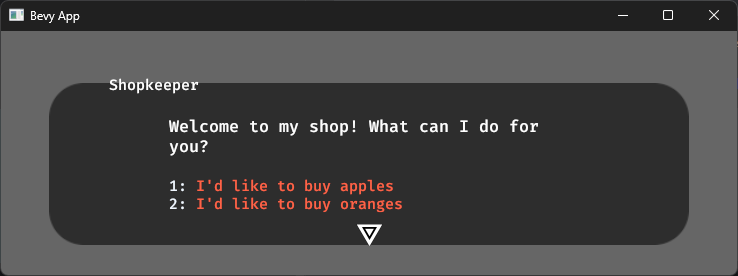

# Options
The syntax for asking the player to make a choice looks like this:
```text
title: Start
---
Ferris: So, how's life these days?
-> Pretty good, actually.
-> Could be better.
===
```

This results in the following dialogue window:


By indenting the lines after an option, you can selectively branch a dialogue:
```text
title: Start
---
Ferris: So, how's life these days?
-> Pretty good, actually.
    Ferris: That's great to hear!
-> Could be better.
    Ferris: Oh no! What's wrong?
===
```
In this example, the character "Ferris" will only answer with "That's great to hear!" if the player chooses the first option.
This can also be used to conditionally set variables:

```text
title: Start
---
Ferris: So, how's life these days?
<<declare $mood = "">>
-> Pretty good, actually.
    <<set $mood = "good">>
-> Could be better.
    <<set $mood = "bad">>
Ferris: I see. So you're feeling {$mood}?
===
```

You can also nest options within options:
```text
title: Start
---
Ferris: So, how's life these days?
-> Pretty good, actually.
    Ferris: That's great to hear!
    -> I know, right?
        Ferris: Yeah!
-> Could be better.
    Ferris: Oh no! What's wrong?
    -> I don't want to talk about it.
        Ferris: Okay, that's fine.
    -> I'm just tired.
        Ferris: I know how that feels.
===
```
Notice how it's valid to leave the player only one option to choose from, as seen after Ferris says "That's great to hear!".

Unindented lines after options will be executed no matter which option the player chooses:
```text
title: Start
---
Shopkeeper: Welcome to my shop! What can I do for you?
-> I'd like to buy apples
-> I'd like to buy oranges
Shopkeeper: Here you go!
===
```

Finally, boolean variables can be used to determine whether an option should be available or not:
```text
title: Start
---
Shopkeeper: Welcome to my shop! What can I do for you?
<<declare $eats_meat = false>>
-> I'd like to buy apples
-> I'd like to buy oranges
-> I'd like to buy salami <<if $eats_meat>>
===
```

The above file will result in the following dialogue window:


